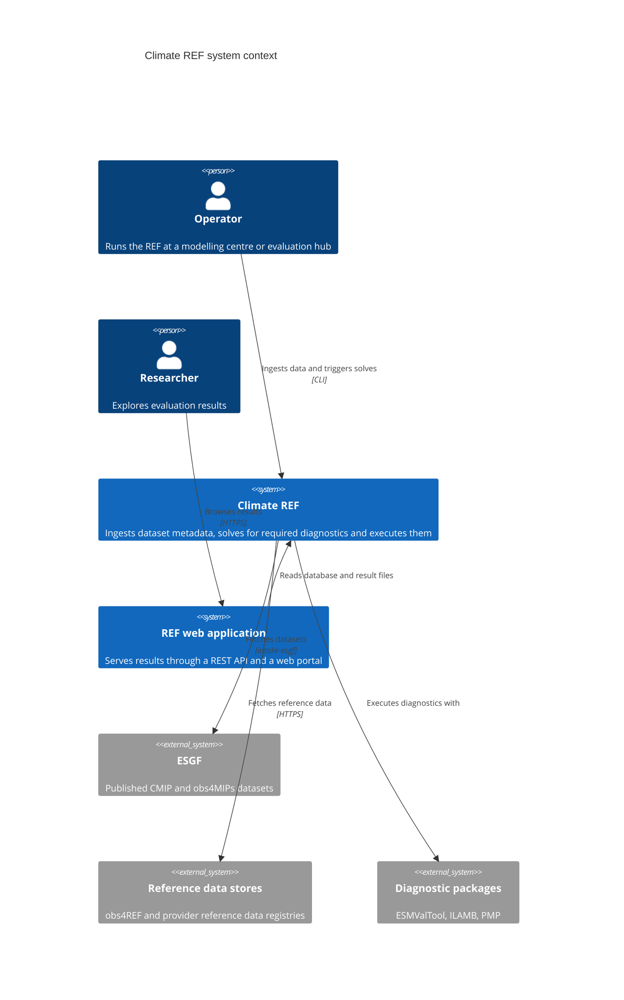
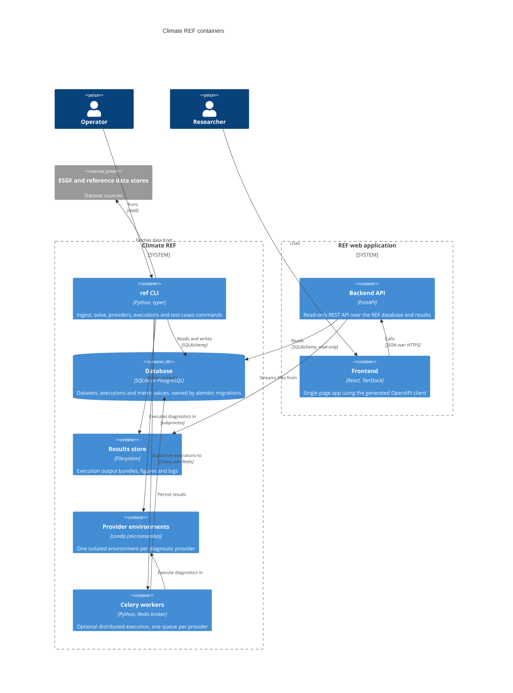
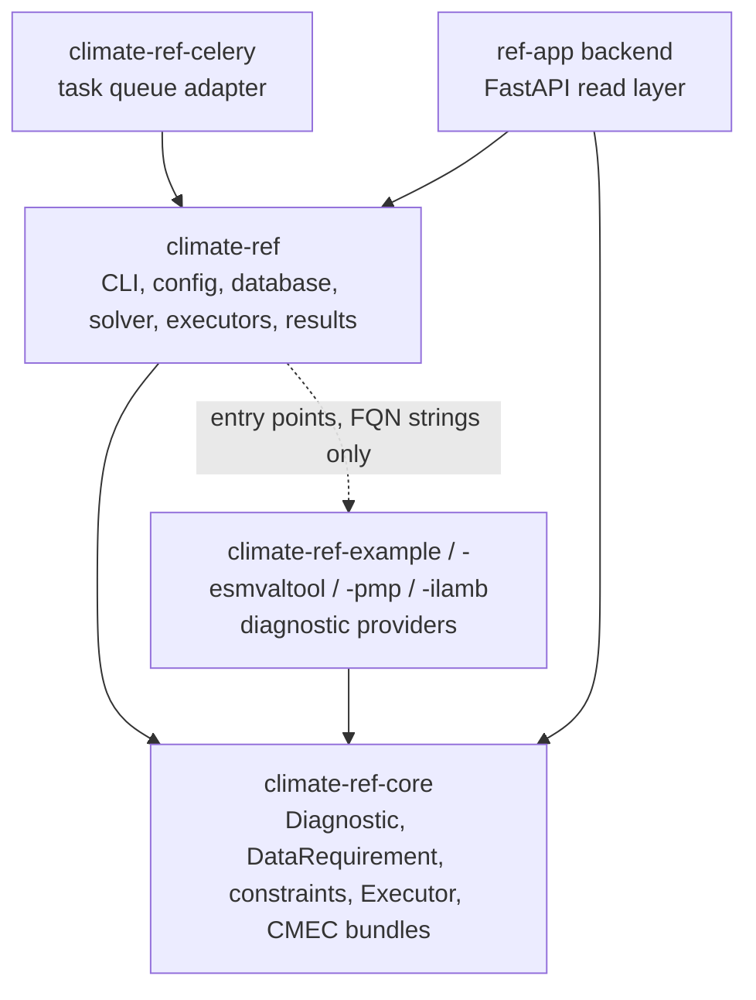
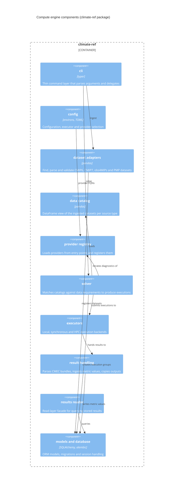
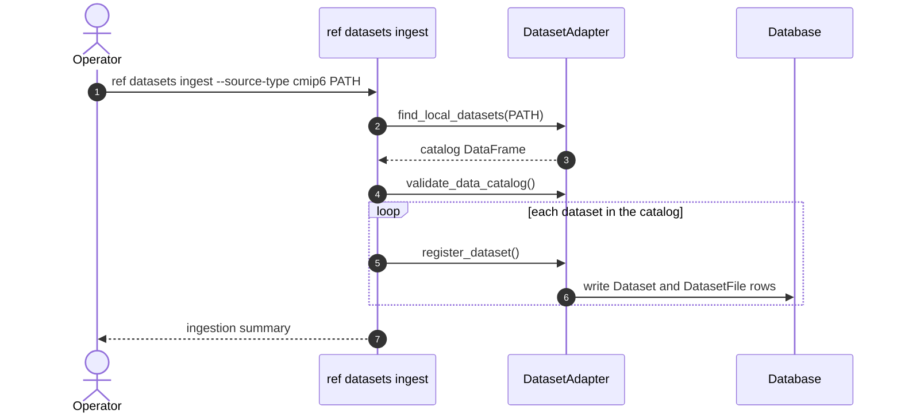
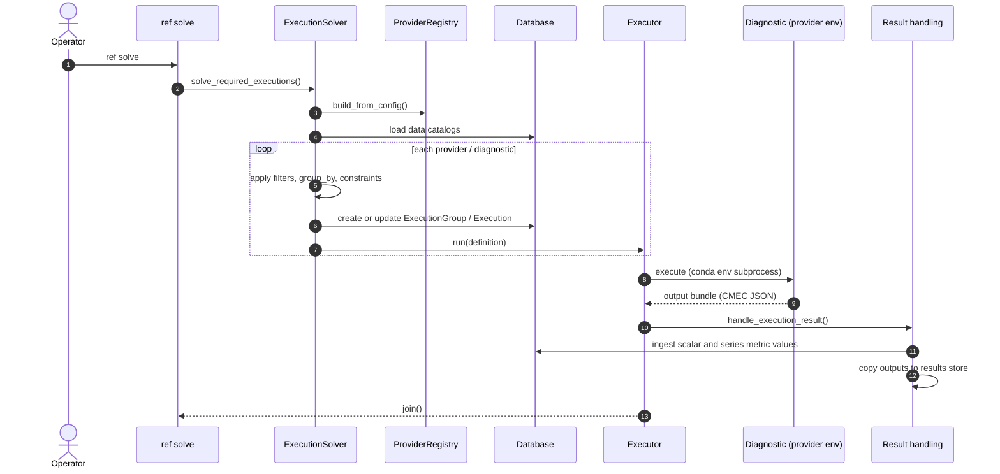
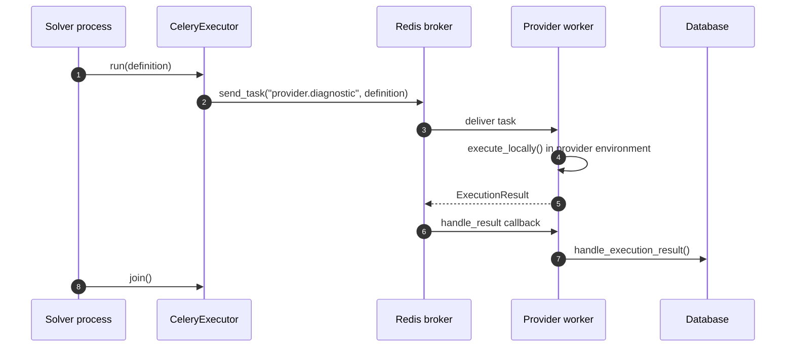
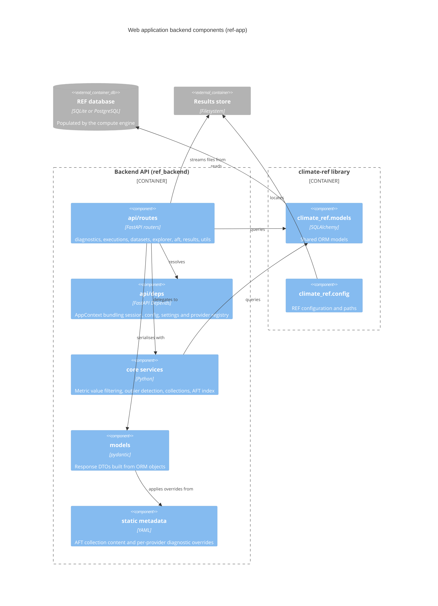

# Architecture

This page describes how the Rapid Evaluation Framework (REF) is put together:
the systems involved, the packages and their layering, the components inside each package,
and the runtime flows that connect them.
It is a description of the system as implemented.
For the vocabulary and the ideas behind the workflow, start with [Concepts](../concepts.md).
For the stable extension points that providers depend on, see the [API surface](../api-surface.md).

The REF was designed for the CMIP7 Assessment Fast Track (AFT):
near-real-time benchmarking of Earth System Models against observational datasets as they are submitted,
producing scalar, timeseries and gridded diagnostics along with figures and web pages.
The CMIP7 Model Benchmarking Task Team (MBTT) identified the initial set of diagnostics,
which are implemented by existing benchmarking packages (ESMValTool, ILAMB, PMP).

## Design goals

The key objectives that shaped the design:

- **Modular.** This is a community project.
  It should be easy for existing and future benchmarking packages to integrate with the framework,
  and the developer experience for providers is paramount.
- **Extensible.** The AFT targets a small subset of possible diagnostics.
  The set will grow over time in data volume and complexity.
- **Reusable.** The REF targets multiple deployment environments and a range of users,
  so components should be reusable in different contexts.
  Not every component needs to be installed for a usable system.
  A headless deployment without the API and portal is fully supported.

And the constraints:

- Deployment environments at modelling centres cannot be controlled,
  so the REF must support several ways of running (local process pool, task queue, HPC schedulers).
- Different users have different areas of interest,
  which drives the ability to run the REF locally rather than only as a centralised service.
- The development is Python based to be accessible to the research community.

The design principles that follow from these:

- **Separation of concerns.** Providers focus on the science.
  The framework tracks state and decides what to run.
  A provider developer needs in-depth knowledge of only a small part of the system.
- **Resilience.** One bad input dataset must not cause a cascading failure.
  Failures are recorded per execution and retried according to their failure class.

## System context

The REF sits between the data archives and the people who want evaluation results.

Two systems are under our control:

- **Climate REF** (this repository) is the compute engine.
  It indexes datasets, decides which diagnostics need to run, runs them, and records the results.
- The **[REF web application](https://github.com/Climate-REF/ref-app)** is a separate repository
  containing a read-only REST API and a React frontend for browsing the results.
  It is deployable at modelling centres as well as centrally.

The science itself lives in the external benchmarking packages.
The REF does not perform any scientific calculations.

## Containers

Zooming in one level, these are the deployable pieces and stores that make up a full installation.

Notes on the individual containers:

- The **`ref` CLI** is the single entry point for operating the compute engine.
  All orchestration (ingest, solve, execute, inspect) happens through it.
- The **database** is SQLite by default and PostgreSQL in production deployments.
  The schema is owned by alembic migrations in the `climate-ref` package.
  It records what data is available, what has run, and every scalar and series metric value produced.
- The **results store** is a directory tree of execution outputs:
  CMEC metric and output bundles, figures, data files and logs.
- Each **provider environment** is a conda environment built with micromamba,
  so providers with incompatible dependencies can coexist.
  See `ref providers setup`.
- **Celery workers** are optional.
  The default local executor runs executions in a process pool without any extra services.
  See [Executors](../how-to-guides/executors.md) for the full set of options.

## Package layering

The monorepo is a uv workspace with seven packages.
Source dependencies point in one direction, towards `climate-ref-core`.

| Package | Role | Depends on |
| --- | --- | --- |
| `climate-ref-core` | Domain abstractions: `Diagnostic`, `DataRequirement`, constraints, the `Executor` protocol, CMEC bundle handling | third-party only |
| `climate-ref` | The application: CLI, configuration, database, solver, executors, results read layer | `climate-ref-core` |
| `climate-ref-celery` | Celery app and `CeleryExecutor` for distributed execution | `climate-ref`, `climate-ref-core` |
| provider packages | Thin wrappers exposing each benchmarking package's diagnostics | `climate-ref-core` |
| ref-app backend | Read-only API over the REF database and results (separate repository) | `climate-ref`, `climate-ref-core` |

Three properties of this layering do most of the architectural work:

- `climate-ref-core` is a dependency leaf.
  It imports no other REF package and knows nothing about the database.
  Providers can be written and tested against it alone.
- Providers are plugins.
  Each registers itself through the `climate-ref.providers` entry point group,
  and the application refers to providers only by name in configuration, never by import.
  Installing a provider package makes it available.
  Enabling it is a configuration decision.
- Executors are resolved from configuration by fully qualified name against the
  [Executor][climate_ref_core.executor.Executor] protocol,
  so new execution backends plug in without changes to the framework.

## Inside the compute engine

The `climate-ref` package contains the components that orchestrate the workflow.

- **CLI** (`climate_ref.cli`): typer commands grouped by noun
  (`datasets`, `solve`, `providers`, `executions`, `diagnostics`, `db`, `test-cases`).
  The commands stay thin and delegate to the components below.
- **Configuration** (`climate_ref.config`): a TOML file under `REF_CONFIGURATION`,
  overridable per field through `REF_*` environment variables.
  It selects the executor and the enabled providers by fully qualified name.
- **Dataset adapters** (`climate_ref.datasets`): one adapter per source type
  (CMIP6, CMIP7, obs4MIPs, PMP climatologies).
  An adapter finds local files, parses their metadata into a catalog DataFrame,
  validates it, and registers datasets and files in the database.
  Reference datasets (obs4REF and ESMValTool reference data) are ingested through a separate
  declarative path driven by the providers rather than through these adapters.
  See [Datasets](datasets.md) for the parsers and the two-phase ingestion design.
- **Solver** (`climate_ref.solver`): the heart of the compute engine.
  It loads the data catalog for each source type,
  applies each diagnostic's [data requirements][climate_ref_core.diagnostics.DataRequirement]
  (facet filters, then grouping, then group constraints),
  and produces the set of executions that need to run.
  Group hashing against previously recorded executions decides what is out of date.
- **Provider registry** (`climate_ref.provider_registry`): loads the configured providers
  through their entry points and records them in the database.
- **Executors** (`climate_ref.executor`): local process pool (default), synchronous (in process),
  and HPC schedulers.
  The Celery executor lives in its own package.
- **Result handling** (`climate_ref.executor.result_handling`): parses the CMEC output bundles,
  ingests scalar and series metric values, registers output files, and copies outputs into the results store.
- **Results reader** (`climate_ref.results`): a read-layer facade for querying stored results as DataFrames,
  used for local analysis and notebooks.
  See [Reading results locally](../how-to-guides/reading-results-locally.md).
- **Test cases and regression** (`climate_ref.cli.test_cases` with `climate_ref_core.regression`):
  per-diagnostic regression baselines captured, compared and gated in CI.
  See [Regression baselines](regression-baselines.md).

## Runtime flows

### Ingest

Ingestion extracts metadata from locally available datasets and indexes it in the database.
The REF only knows about data that has been ingested.

### Solve and execute

A solve compares the ingested datasets against every diagnostic's data requirements,
records the resulting execution groups and executions,
and hands the out-of-date executions to the configured executor.

The executor boundary is crossed with plain data structures.
The solver passes an [ExecutionDefinition][climate_ref_core.diagnostics.ExecutionDefinition]
describing the datasets and output location,
and receives an [ExecutionResult][climate_ref_core.diagnostics.ExecutionResult]
built from the CMEC bundles the diagnostic wrote.
Outputs follow the
[Earth System Metrics and Diagnostics Standards (EMDS)](https://github.com/Earth-System-Diagnostics-Standards/EMDS).

### Distributed execution with Celery

With the Celery executor, executions are dispatched to long-lived workers through a Redis broker.
Each provider gets its own queue and its own worker image,
so provider environments stay isolated and can be updated independently.

See [Docker deployment](../how-to-guides/docker_deployment.md) for the containerised form of this setup,
and [Running on HPC](../how-to-guides/hpc_executor.md) for scheduler-based execution.

## The web application

The [ref-app](https://github.com/Climate-REF/ref-app) repository provides the visualisation layer:
a FastAPI backend and a React frontend.
It is currently coupled to the AFT deployment of the REF and is best treated as a reference implementation.

Key characteristics:

- The backend is a **read-only consumer** of the REF database.
  It opens the database without running migrations
  (SQLite can be opened immutable so the state volume can be mounted read-only)
  and reports the results the compute engine has already produced.
- It depends on the `climate-ref` library directly for configuration, models and the provider registry.
  The database schema remains owned by `climate-ref` migrations.
- **AFT display metadata** (collection descriptions, plain-language summaries, explorer cards)
  is maintained as YAML under `backend/static/` rather than in the database,
  so scientific content can be edited without touching either the schema or the frontend.
- The frontend consumes a **TypeScript client generated from the OpenAPI schema**.
  Changing the API means regenerating the client, which keeps the two sides honest.
- Result files (figures, logs, bundles, archives) are streamed straight from the results store on disk.

## Known boundaries and debt

The layering above is enforced by convention and review, not by tooling,
and a few boundaries are weaker than the diagrams suggest:

- The solver both computes the required executions and reads and writes the database in the same module.
  The pure solving logic already yields plain DTOs, so a cleaner split is available.
- `CondaDiagnosticProvider` places conda environment management inside `climate-ref-core`,
  which drags process and download concerns into the innermost package.
- The ref-app backend queries the `climate-ref` ORM models directly rather than a published read contract,
  which couples the two repositories through the database schema.
  The `climate_ref.results` reader is the seam for narrowing that contract,
  and adoption has started with the metric value endpoints
  ([ref-app #39](https://github.com/Climate-REF/ref-app/pull/39)).
  The remaining routes and DTO builders still query the ORM directly.

These are recorded here so that readers do not mistake the target picture for the current one.
