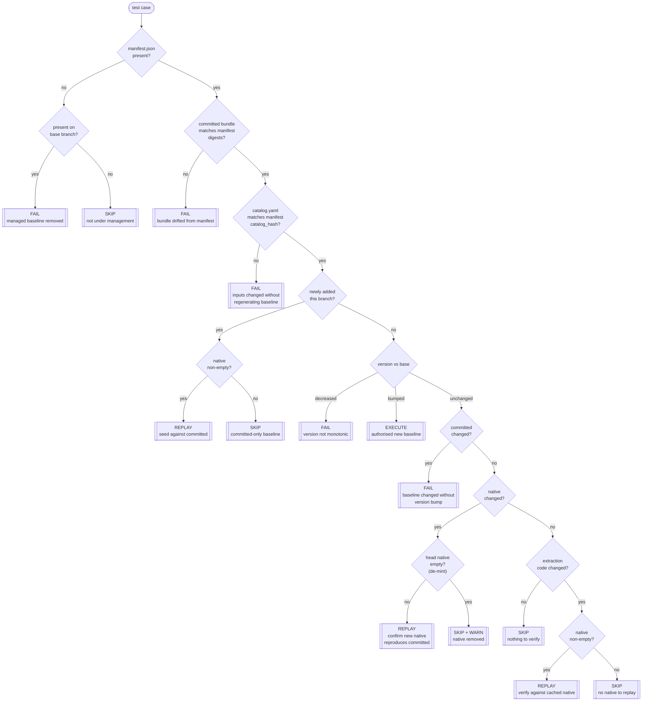

# Regression baselines and the CI coupling gate

Climate REF pins each test case to a **regression baseline**:
a recorded, known-good output that a pull request is checked against
so that an unintended change in a diagnostic's results cannot land unnoticed.

This page explains the two-layer baseline model,
the lifecycle commands that produce and verify it,
and the CI coupling gate that decides *how* each test case is verified in a pull request.

## The two-layer baseline model

A baseline is split into two layers with very different trust and portability properties.

- The **committed bundle** is the small, text-only CMEC output
  (`series.json`, `diagnostic.json`, `output.json`)
  written into the test case's `regression/` directory and tracked in git.
  Absolute paths are rewritten to portable placeholders
  (`<OUTPUT_DIR>`, `<TEST_DATA_DIR>`) so the bytes are machine independent.
  This bundle is **the gate signal**: it is what review actually sees in the diff.

- The **native bundle** is the heavy binary output
  (`.nc`, `.png`, ...) that the committed bundle references.
  Native files are content-addressed by their sha256 digest in an object store,
  fetched anonymously, and are **never required to be present**.
  They are written only by the credentialed `mint` step.

The two layers are bound by a **`manifest.json`** alongside the bundle, which records:

- `test_case_version` — a monotonic, author-bumped integer that *authorises* a new baseline.
- `committed` — sha256 digests of the committed JSON artefacts, over the exact placeholder-substituted bytes on disk.
- `native` — sha256 + size of each curated native file (empty `{}` until minted).
- `catalog_hash` — the hash of the test case's input `catalog.yaml`, coupling the baseline to the inputs that produced it.

!!! note "An empty native set is a permanent, valid state"
    Fork contributors cannot mint
    (minting needs object-store write credentials that never run on untrusted pull-request code).
    A baseline with `native: {}` is fully gated by its committed JSON bundle;
    the native layer is **opt-in extra verification** that only runs when the blobs exist.

## Lifecycle commands

The `ref test-cases` verbs produce and verify baselines.
Only `mint` needs write credentials; everything else is anonymous and safe on untrusted code.

| Verb | Credentials | What it does |
| --- | --- | --- |
| `run` | none | Execute the diagnostic, curate outputs, write the committed bundle and seed `manifest.json` (`native = {}`). |
| `mint` | write | Upload the curated native files to the object store and populate `manifest.native`. Generally run by CI. |
| `sync` | public read | Fetch the native blobs referenced by the manifest into the local tree. |
| `replay` | public read | Materialise the native baseline, re-run only `build_execution_result`, and tolerantly compare to the committed bundle. |

## Tolerant comparison

`replay` and the execute path do not require byte-equality of the regenerated JSON.
A byte-equal fast path short-circuits the common case;
otherwise values are compared with a small relative/absolute tolerance
(`math.isclose`), and volatile keys/values are sanitised to placeholders before comparison.
This absorbs platform-level floating-point noise without masking a real change in results.

## The CI coupling gate

For every test case, CI must decide *how* to verify the baseline in a pull request,
purely from what changed relative to the base branch.
`decide_coupling` is a pure function over the head and base manifests
plus three on-disk facts the caller supplies —
whether the diagnostic's extraction code changed,
whether the committed bundle still matches its manifest digests,
and whether the input catalog still matches its manifest hash.

The gate **fails closed**:
any state it cannot positively verify is a failure, not a silent skip.
The single exception is the native layer —
because an empty native set is legitimate, a missing native baseline downgrades to `skip` (with a warning), never `fail`.

### Actions

- **`skip`** — nothing relevant to this case changed, or the case is not under regression management.
- **`replay`** — cheap, anonymous re-check against the cached native baseline (only when native blobs exist).
- **`execute`** — full end-to-end re-run with tolerant compare; required when `test_case_version` was bumped to authorise a new baseline.
- **`fail`** — an unauthorised or unverifiable change (committed bundle edited without a version bump, version moved backwards, bundle drifted from its manifest, or catalog changed without regenerating the baseline).

### Decision flow

### How changed files map to the signals

The gate diffs `base...HEAD` (against the merge base, so unrelated base-branch churn is excluded)
and maps the changed-file list onto each case:

- **`extraction_changed`** is coarse and errs toward `replay` (cheap, credential-free):
  any change under the diagnostic's provider package,
  or under the core regression package, counts for every case in that provider.
- **`committed_integrity_ok`** recomputes the committed digests from the working tree
  and compares them to `manifest.committed`.
- **`catalog_integrity_ok`** recomputes the input catalog hash
  and compares it to `manifest.catalog_hash`,
  catching an input change that was not accompanied by a regenerated baseline.

The gate exits non-zero if any case is gated `fail`;
the `--json` output drives CI's dispatch of the `replay` and `execute` jobs.

!!! warning "Credentials never cross the trust boundary"
    `replay`, `sync`, `run`, and the gate itself are anonymous and safe to run on untrusted pull-request code.
    Only `mint` holds object-store write credentials,
    and it runs exclusively on the trusted-tier runner — never on fork pull-request code.
