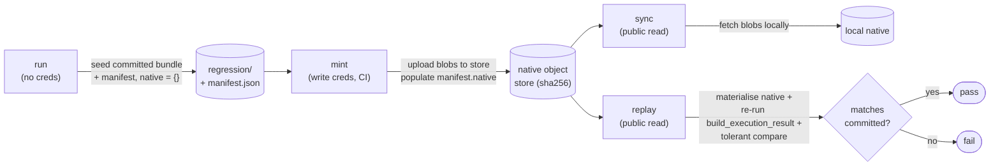
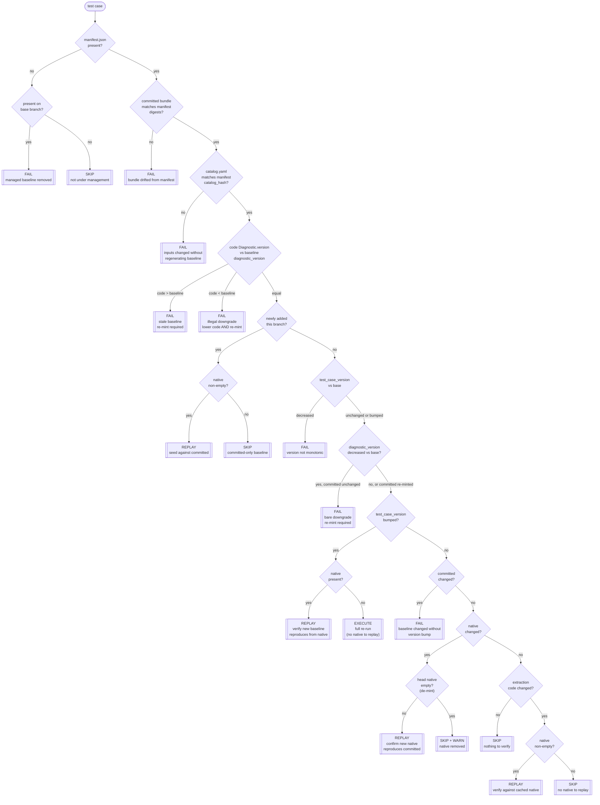

# Regression baselines and the CI coupling gate

Climate REF pins each test case to a **regression baseline**:
a recorded, known-good output that a pull request is checked against
so that an unintended change in a diagnostic's results cannot land unnoticed.

This page explains the two-layer baseline model,
the lifecycle commands that produce and verify it,
and the CI coupling gate that decides *how* each test case is verified in a pull request.

## The two-layer baseline model

A baseline is split into two layers with very different trust and portability properties.

- The **committed bundle** is the small, text-only CMEC output
  (`series.json`, `diagnostic.json`, `output.json`)
  written into the test case's `regression/` directory and tracked in git.
  Absolute paths are rewritten to portable placeholders
  (`<OUTPUT_DIR>`, `<TEST_DATA_DIR>`) so the bytes are machine independent.
  This bundle is **the gate signal**: it is what review actually sees in the diff.

- The **native bundle** is the heavy binary output
  (`.nc`, `.png`, ...) that the committed bundle references.
  Native files are content-addressed by their sha256 digest in an object store,
  fetched anonymously, and are **never required to be present**.
  They are written only by the credentialed `mint` step.

The two layers are bound by a **`manifest.json`** alongside the bundle, which records:

- `schema` — integer schema version for the manifest format itself (currently `2`).
  The loader rejects manifests whose `schema` does not match the current `SCHEMA_VERSION`,
  so format migrations are detected immediately rather than silently misread.
- `test_case_version` — a monotonic, author-bumped integer that *authorises* a new baseline.
- `diagnostic_version` — the author-declared `Diagnostic.version` captured at mint time,
  coupling the baseline to the diagnostic code that produced it.
- `committed` — sha256 digests of the committed JSON artefacts, over the exact placeholder-substituted bytes on disk.
- `native` — sha256 + size of each curated native file (empty `{}` until minted).
- `catalog_hash` — the hash of the test case's input `catalog.yaml`, coupling the baseline to the inputs that produced it.

These give the manifest **two orthogonal version axes**:
`test_case_version` is per-case and mint-authored (it authorises a new committed baseline),
while `diagnostic_version` is per-diagnostic and author-authored (it declares that the
diagnostic's *results* changed). `test_case_version` remains monotonic, and `diagnostic_version`
may move backwards only for an authorised revert. The gate consults each for a different purpose.

!!! note "An empty native set is a permanent, valid state"
    Fork contributors cannot mint
    (minting needs object-store write credentials that never run on untrusted pull-request code).
    A baseline with `native: {}` is fully gated by its committed JSON bundle;
    the native layer is **opt-in extra verification** that only runs when the blobs exist.

## Lifecycle commands

The `ref test-cases` verbs produce and verify baselines.
Only `mint` needs write credentials; everything else is anonymous and safe on untrusted code.



| Verb | Credentials | What it does |
| --- | --- | --- |
| `run` | none | Execute the diagnostic, curate its native into the output slot `output/<label>/`, rebuild the committed bundle, and — when seeding or `--force-regen` — promote it to `regression/` and update `manifest.json` (first seed uses `native = {}`; existing manifests keep their native block). |
| `build` | none | Rebuild the committed bundle from an existing output slot (no execution), under the same promotion gate as `run`. Handy for regenerating the bundle after an extraction-code change, from already-materialised native. |
| `mint` | write | Execute (or, with `--from-replay`, replay the stored native), upload the curated native to the object store, and populate `manifest.native`. Generally run by CI. |
| `sync` | public read | Fetch the native blobs referenced by the manifest into the local store cache. |
| `replay` | public read | Materialise the native baseline into a slot, re-run only `build_execution_result`, and tolerantly compare to the committed bundle. |
| `check-store` | write | Preflight the writable native store (credentials + bucket) without uploading anything. Run this before a slow `mint` to confirm credentials are correct. |
| `migrate-manifests` | none | One-shot, idempotent maintenance command that rewrites every committed `manifest.json` at the current `SCHEMA_VERSION`, stamping each case's `diagnostic_version` from the diagnostic's in-code `Diagnostic.version`. |

### Output slots

Every `run`, `build`, `replay`, and `mint` materialises what it produced into a gitignored
*output slot*, so a developer can actually see and diff what a run or replay generated:

```text
<test case>/output/<label>/
├── diagnostic.json     # the curated native set, flat at manifest-relative paths
├── output.json
├── series.json
├── ...                 # plus any referenced plots/data/html and native .nc files
├── regression/         # the committed bundle rebuilt from this slot
│   ├── diagnostic.json
│   ├── output.json
│   └── series.json
└── .source.json        # {label, verb, source, test_case_version, created}
```

Slots are never committed — the whole `**/test-data/**/output/` tree is gitignored —
they exist purely for local inspection.

The `--label` option names a slot (default `latest`, overwritten on every run).
Named slots persist, so two runs can be compared side by side:
for example `run --label fresh` then `replay --label fromstore`,
or `run --label before`, edit the diagnostic, then `run --label after`.

`run` and `build` write the slot on every invocation
but only *promote* the rebuilt bundle to the tracked `regression/` baseline
when `--force-regen` is given or no baseline exists yet,
so a labelled run never silently clobbers a committed baseline;
`mint` always promotes and uploads.
When a promoted bundle's underlying native digests differ from the minted baseline,
`run` and `build` warn (they never block) that a re-mint is needed.
`mint --from-replay` re-authors the manifest from the stored native instead of re-executing,
and uploads only blobs whose digest actually changed.

## CMIP7 test data

CMIP7 data is not yet available on ESGF,
so `CMIP7Request` (importable from `climate_ref_core.esgf`) bridges the gap:
it internally maps CMIP7 facets to their CMIP6 equivalents (e.g. `variant_label` -> `member_id`),
fetches the corresponding CMIP6 files, and converts them to CMIP7 format on the fly.

Converted files are cached under the user cache directory at `climate_ref/cmip7-converted/`
(resolved by `platformdirs.user_cache_dir`), so repeated fetches for the same request are cheap.
The cache is not version-controlled; clear it manually if a conversion produces stale output.

Use `CMIP7Request` in `test_data_spec` exactly like `CMIP6Request`:

```python
from climate_ref_core.esgf import CMIP7Request

CMIP7Request(
    slug="cmip7-tas",
    facets={
        "source_id": "ACCESS-ESM1-5",
        "experiment_id": "historical",
        "variable_id": "tas",
        "variant_label": "r1i1p1f1",   # CMIP7 name; maps to member_id internally
        "table_id": "Amon",
    },
)
```

## Committed-bundle float precision

Floats written into the committed bundle (`series.json`, `diagnostic.json`, `output.json`)
are rounded to **7 significant figures** at write time.
This keeps the committed bytes stable and human-reviewable across machines (local developer run vs. CI mint),
where tiny floating-point differences would otherwise produce noisy diffs on every baseline update.

Seven significant figures is deliberately one digit finer than the `rtol=1e-6`
tolerance used by the coupling gate's tolerant comparison,
so rounding at write time can never flip a gate verdict:
a value that rounds identically on all machines will always compare within tolerance.

## Tolerant comparison

`replay` and the execute path do not require byte-equality of the regenerated JSON.
A byte-equal fast path short-circuits the common case;
otherwise values are compared with a small relative/absolute tolerance
(`math.isclose`), and volatile keys/values are sanitised to placeholders before comparison.
This absorbs platform-level floating-point noise without masking a real change in results.

## The CI coupling gate

For every test case, CI must decide *how* to verify the baseline in a pull request,
purely from what changed relative to the base branch.
`decide_coupling` is a pure function over the head and base manifests
plus three on-disk facts the caller supplies —
whether the diagnostic's extraction code changed,
whether the committed bundle still matches its manifest digests,
and whether the input catalog still matches its manifest hash.

The gate **fails closed**:
any state it cannot positively verify is a failure, not a silent skip.
The single exception is the native layer —
because an empty native set is legitimate, a missing native baseline downgrades to `skip` (with a warning), never `fail`.

### Actions

- **`skip`** — nothing relevant to this case changed, or the case is not under regression management.
- **`replay`** — cheap, anonymous re-check against the cached native baseline (only when native blobs exist). This also verifies a `test_case_version` bump that ships native blobs.
- **`execute`** — full end-to-end re-run with tolerant compare; required when `test_case_version` was bumped to authorise a new baseline *and* no native baseline exists to replay against.
- **`fail`** — an unauthorised or unverifiable change: the committed bundle or catalog changed without a version bump, a version moved backwards, the bundle drifted from its manifest, or the in-code `Diagnostic.version` no longer matches the recorded `diagnostic_version`.

### Decision flow



### How changed files map to the signals

The gate diffs `base...HEAD` (against the merge base, so unrelated base-branch churn is excluded)
and maps the changed-file list onto each case:

- **`extraction_changed`** is coarse and errs toward `replay` (cheap, credential-free):
  any change under the diagnostic's provider package,
  or under the core regression package, counts for every case in that provider.
  It is a *path-based* heuristic, so it cannot tell an execution change from an extraction change.
- **`diagnostic_version`** is the *author-declared* execution-change signal: when a diagnostic's
  results change the author bumps `Diagnostic.version`, and the gate fails any baseline whose
  recorded `diagnostic_version` no longer matches the in-code value until it is re-minted.
  This closes the **replay blind-spot** that `extraction_changed` alone leaves open:
  an execution-affecting change with no extraction-path edit (the #671 ECS case) would otherwise
  route to a green replay against a stale bundle.
  A `diagnostic_version` decrease is permitted only as an **authorised revert**: the author lowers
  the code version *and* re-mints, so the committed bundle changes and the gate recognises the
  revert structurally rather than via a flag.
- **`committed_integrity_ok`** recomputes the committed digests from the working tree
  and compares them to `manifest.committed`.
- **`catalog_integrity_ok`** recomputes the input catalog hash
  and compares it to `manifest.catalog_hash`,
  catching an input change that was not accompanied by a regenerated baseline.

The gate exits non-zero if any case is gated `fail`;
the `--json` output drives CI's dispatch of the `replay` and `execute` jobs.

!!! warning "Credentials never cross the trust boundary"
    `replay`, `sync`, `run`, and the gate itself are anonymous and safe to run on untrusted pull-request code.
    Only `mint` holds object-store write credentials,
    and it runs exclusively on the trusted-tier runner — never on fork pull-request code.

## Continuous integration

The lifecycle commands are wired into three GitHub Action workflows.
The minting process requires credentials to upload data.
Since this is a public project we have to be careful about when this is run to not leak these credentials.

| Workflow | Trigger | Credentials | What it does |
| --- | --- | --- | --- |
| `regression-pr-gate.yaml` | every pull request | none | Runs the coupling gate, then `replay`s every case it routes to `replay`. |
| `regression-mint.yaml` | manual dispatch | R2 write | `mint`s native baselines and commits the regenerated manifest back to the branch. |
| `regression-drift.yaml` | nightly + manual | none | `sync`s and `replay`s every baseline to catch silent drift. |

### PR gate (`regression-pr-gate.yaml`)

On every pull request, the gate runs `ref test-cases ci-gate --json` against the base
branch and acts on each decision:

- **`fail`** aborts the job with the offending cases and their reasons.
- **`replay`** is verified in place against the public native baseline.
- **`execute`** is surfaced as a warning: a `test_case_version` bump with no native baseline to replay against cannot be verified
   (it would need a full diagnostic run), so the committed bundle is gated by review here and and requires `minting`.

The job runs on the public `ubuntu-latest` runner with no secrets, so it is safe on fork pull requests.
The decision-to-replay fan-out lives in `scripts/ci/regression-pr-gate.sh`.

Neither stage downloads input datasets:
`ci-gate` reads only manifests and the git diff,
and `replay` rebuilds the committed bundle from the public native blobs plus the committed `catalog.yaml`/`manifest.json`
(`build_execution_result` reads only its output directory).
The gate therefore fetches no sample data or ESGF inputs — only the small native blobs for the cases it actually replays.

#### Running the gate locally

The same script is the local entry point, so you can reproduce a pull request's verdict before pushing:

```bash
make regression-gate                          # gate + replay against origin/main
bash scripts/ci/regression-pr-gate.sh main    # or pass any base ref
```

The base ref defaults to `origin/${GITHUB_BASE_REF:-main}`.
Under GitHub Actions the script emits log groups and `::error::`/`::warning::` annotations;
run locally it prints plain output instead.

### Gated mint (`regression-mint.yaml`)

Minting is the only step that writes to the object store,
so it is **manually dispatched** and gated behind the `native-baselines` GitHub Environment.
Dispatch it on the feature branch that should receive the new baseline:
the job runs `mint`, and commits the regenerated `manifest.json` (and committed bundle) back to that branch,
so the change is reviewed through its pull request and no developer ever needs write credentials.
A `dry_run` input previews without uploading or committing, and the job refuses to run on the default branch.

!!! warning "The mint commit does not re-trigger the PR gate"
    The mint job pushes with the default `GITHUB_TOKEN`, and GitHub deliberately does not start new workflow runs for such pushes.
    So the freshly minted manifest is *not* automatically `replay`-verified by `regression-pr-gate.yaml`.
    After minting, push a follow-up commit (or re-run the PR gate from the Actions tab) to verify the new native baseline reproduces the committed bundle.

!!! note "Required repository configuration"
    Create a `native-baselines` Environment (Settings -> Environments) with **required reviewers**,
    and add two secrets to it holding an object-scoped R2 token:

    - `R2_ACCESS_KEY_ID` -> `REF_NATIVE_STORE_ACCESS_KEY_ID`
    - `R2_SECRET_ACCESS_KEY` -> `REF_NATIVE_STORE_SECRET_ACCESS_KEY`

    The endpoint and bucket default to the production R2 account
    (`REF_NATIVE_STORE_S3_ENDPOINT_URL` / `REF_NATIVE_STORE_BUCKET` override them).

### Nightly drift (`regression-drift.yaml`)

A scheduled (and manually dispatchable) job `sync`s every referenced native blob and `replay`s it against the committed bundle.
This catches a baseline that no longer reproduce the committed results within tolerance — for example after a dependency upgrade. It is read-only and credential-free.
