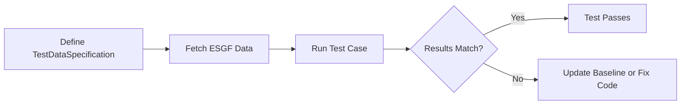

# Testing Diagnostics

This guide explains how to set up reproducible tests for your diagnostic provider package.
The testing infrastructure allows you to define `test cases`.

Each `test case` describes an execution of a diagnostic with specific datasets.
The test infrastructure takes case of fetching data from ESGF, running the diagnotic execution and,
tracking the outputs as regression tests.

## Overview

### Aim

The REF supports many diagnostics across multiple provider packages,
each with different data requirements.
Rather than maintaining a single monolithic test dataset that contains everything every diagnostic might need,
the testing infrastructure allows:

- **Diagnostic-controlled test data**:
    Each diagnostic declares exactly which datasets it needs for testing via `test_data_spec`.
    This keeps test data minimal and focused.

- **Selective fetching**: Developers only need to download test data for the diagnostics they're working on, not the entire test suite.
    This saves disk space and download time.

- **Independent testing**: Updates to a diagnostics data requirements doesn't impact other diagnostics results.
    This makes it easier to contribute new diagnostics.

- **Reproducible results**: By pinning specific ESGF datasets (source, experiment, time range),
  tests produce consistent results across different machines and CI environments.

/// note
The [ref-sample-data](https://github.com/Climate-REF/ref-sample-data) repository
represents the original monolithic approach - a centrally managed collection of decimated test datasets for all diagnostics.
While this worked for the first round of diagnostics,
it requires coordination to add new test data and updating the sample data often lead to impacts for other diagnostics.

An alternative approach was required that was easier to maintain ([#472](https://github.com/Climate-REF/climate-ref/issues/472)).
///

### Workflow

The testing workflow consists of:

1. **Define test data specifications** in your diagnostic class
2. **Fetch test data** from ESGF using CLI commands
3. **Run test cases** via CLI or pytest
4. **Compare results** against regression baselines



## Defining Test Data Specifications

Each diagnostic defines a `test_data_spec` attribute that declares exactly which datasets it needs for testing.
The specification contains one or more independent test cases.
Each test case represents the data needed for a single execution.

When a test case runs, only those specific datasets are used -
the test infrastructure filters out any other data that may be present.
This ensures reproducible test execution regardless of what other data exists locally.

### Basic Structure

```python
from climate_ref_core.testing import TestDataSpecification, TestCase
from climate_ref_core.esgf import CMIP6Request, Obs4MIPsRequest

class MyDiagnostic(Diagnostic):
    name = "My Diagnostic"
    slug = "my-diagnostic"

    # ... data_requirements and other attributes ...

    test_data_spec = TestDataSpecification(
        test_cases=(
            TestCase(
                name="default",
                description="Standard test with historical data",
                requests=(
                    CMIP6Request(
                        slug="test-tas",
                        facets={
                            "source_id": "ACCESS-ESM1-5",
                            "experiment_id": "historical",
                            "variable_id": "tas",
                            "member_id": "r1i1p1f1",
                            "table_id": "Amon",
                        },
                    ),
                ),
            ),
        ),
    )
```

### TestCase Attributes

| Attribute       | Type                         | Description                                                    |
| --------------- | ---------------------------- | -------------------------------------------------------------- |
| `name`          | `str`                        | Unique identifier (e.g., `"default"`, `"edge-case"`)           |
| `description`   | `str`                        | Human-readable description of the test scenario                |
| `requests`      | `tuple[ESGFRequest, ...]`    | ESGF requests to fetch the required datasets for the test case |
| `datasets`      | `ExecutionDatasetCollection` | Explicit datasets (highest priority)                           |
| `datasets_file` | `str`                        | Path to YAML file with datasets (relative to package)          |

### ESGF Requests

Each test case declares the set of data that is required from ESGF.
Only datasets resolved by these requests will be available when using the test case.

ESGF's [Metagrid](https://esgf-node.ornl.gov/) can be used to explore the results from applying different facet filters.

#### CMIP6Request

For CMIP6 model output:

```python
from climate_ref_core.esgf import CMIP6Request

CMIP6Request(
    slug="unique-identifier",
    facets={
        "source_id": "ACCESS-ESM1-5",      # Model name
        "experiment_id": "historical",      # Experiment
        "variable_id": "tas",               # Variable
        "member_id": "r1i1p1f1",           # Ensemble member
        "table_id": "Amon",                # MIP table (frequency)
        "grid_label": "gn",                # Optional: grid type
    },
    time_span=("2000-01", "2014-12"),  # Optional: YYYY-MM format
    remove_ensembles=False,             # Keep all ensemble members
)
```

#### Obs4MIPsRequest

For observational datasets:

```python
from climate_ref_core.esgf import Obs4MIPsRequest

Obs4MIPsRequest(
    slug="obs-tas",
    facets={
        "source_id": "ERA5",
        "variable_id": "tas",
        "frequency": "mon",
    },
)
```

### Common CMIP6 Facets

| Facet            | Description     | Example                    |
| ---------------- | --------------- | -------------------------- |
| `source_id`      | Model name      | `"ACCESS-ESM1-5"`          |
| `experiment_id`  | Experiment      | `"historical"`, `"ssp585"` |
| `variable_id`    | Variable        | `"tas"`, `"pr"`            |
| `member_id`      | Ensemble member | `"r1i1p1f1"`               |
| `table_id`       | MIP table       | `"Amon"`, `"fx"`  |
| `grid_label`     | Grid type       | `"gn"`, `"gr"`             |
| `institution_id` | Institution     | `"CSIRO"`                  |
| `activity_drs`   | Activity        | `"CMIP"`, `"ScenarioMIP"`  |

### Dataset Resolution Priority

When running a test case, datasets are resolved in this order:

1. **Explicit `datasets`**: If provided, used directly
2. **`datasets_file`**: Load from YAML file
3. **Solve from catalog**: Use `requests` to filter available data from the requests and solved

### Using a Datasets File

For complex test cases or when you need precise control over dataset paths,
you can specify datasets via a YAML file:

```python
TestCase(
    name="from-file",
    description="Test case loading datasets from YAML",
    datasets_file="test_datasets/my_diagnostic.yaml",
)
```

The YAML file follows the same structure used by the data catalog:

```yaml
# test_datasets/my_diagnostic.yaml
cmip6:
  slug_column: instance_id
  selector:
    source_id: ACCESS-ESM1-5
    member_id: r1i1p1f1
  datasets:
    - instance_id: CMIP6.CMIP.CSIRO.ACCESS-ESM1-5.historical.r1i1p1f1.Amon.tas.gn.v20191115
      path: /path/to/tas_Amon_ACCESS-ESM1-5_historical_r1i1p1f1_gn_200001-201412.nc
      variable_id: tas
      table_id: Amon
      source_id: ACCESS-ESM1-5
      experiment_id: historical
      member_id: r1i1p1f1
      grid_label: gn
      version: v20191115
    - instance_id: CMIP6.CMIP.CSIRO.ACCESS-ESM1-5.historical.r1i1p1f1.fx.areacella.gn.v20191115
      path: /path/to/areacella_fx_ACCESS-ESM1-5_historical_r1i1p1f1_gn.nc
      variable_id: areacella
      table_id: fx
      source_id: ACCESS-ESM1-5
      experiment_id: historical
      member_id: r1i1p1f1
      grid_label: gn
      version: v20191115
```

This approach is useful when:

- You have pre-existing test data in specific locations
- You need to test against local modifications of datasets
- You want to test a specific edgecase

## CLI Commands

### Listing Test Cases

View all available test cases:

```bash
ref test-cases list
ref test-cases list --provider ilamb
```

### Fetching Test Data

Download ESGF data for your test cases:

```bash
# Fetch all test data
ref test-cases fetch

# Fetch for a specific provider
ref test-cases fetch --provider my-provider

# Fetch for a specific diagnostic
ref test-cases fetch --provider my-provider --diagnostic my-diagnostic

# Dry run (show what would be fetched)
ref test-cases fetch --dry-run

# Fetch and run a test case in one step
ref test-cases run --provider my-provider --diagnostic my-diagnostic --fetch
```

When data is fetched, it is stored in intake-esgf's cache directory and a catalog YAML file
is saved to track the resolved datasets:

```raw
tests/test-data/esgf-data/.catalogs/
├── my-provider/
│   └── my-diagnostic/
│       └── default.yaml      # Catalog with dataset metadata and paths
└── ...
```

The catalog YAML contains all the metadata needed to run the test case,
including paths to the local datasets.

#### Data Caching

The `ref test-cases fetch` command uses [intake-esgf](https://github.com/esgf2-us/intake-esgf)
to download datasets from ESGF if they cannot be found locally.
`intake-esgf` supports a two-tier cache system configured via `~/.config/intake-esgf/conf.yaml`:

- **`esg_dataroot`**: Paths checked FIRST for existing data (read-only). Ideal for institutional ESGF mirrors or shared drives.
- **`local_cache`**: Where new downloads are stored if not found in `esg_dataroot`.

The fetch command saves a catalog YAML file that records the paths to these files,
so subsequent test runs can locate the data without re-scanning directories.

/// Note | Using Shared ESGF Data (HPC/Shared Drives)

If your institution has a local ESGF data archive, configure `esg_dataroot` to avoid redundant downloads:

```yaml
# ~/.config/intake-esgf/conf.yaml
esg_dataroot:
  - /shared/cmip6/data      # Institutional ESGF mirror (read-only)
  - /group/climate/esgf     # Group shared cache
local_cache:
  - /scratch/$USER/.esgf    # Personal downloads go here
```

With this configuration, intake-esgf will:

1. Check each `esg_dataroot` path for existing files
2. Only download to `local_cache` if the file isn't found

This is particularly useful on HPC systems where CMIP6 data may already be available on shared filesystems.

For personal workstations without shared data,
you only need to set `local_cache`:

```yaml
# ~/.config/intake-esgf/conf.yaml
local_cache:
  - /path/to/esgf/cache
```

See the [intake-esgf documentation](https://github.com/esgf2-us/intake-esgf) for more configuration options.
///

### Running Test Cases

Execute a test case:

```bash
# Run the default test case
ref test-cases run --provider my-provider --diagnostic my-diagnostic

# Run a specific test case
ref test-cases run --provider my-provider --diagnostic my-diagnostic --test-case edge-case

# Specify output directory
ref test-cases run --provider my-provider --diagnostic my-diagnostic --output-directory ./output

# Regenerate regression baseline
ref test-cases run --provider my-provider --diagnostic my-diagnostic --force-regen
```

## Writing Pytest Tests

The CLI provides a standard harness for running simple test cases.
Sometimes additional custom tests maybe required which require writing tests via `pytest`.

### Using the `run_test_case` Fixture

The `run_test_case` fixture automatically handles missing data by skipping tests:

```python
import pytest

def test_my_diagnostic(run_test_case):
    from my_provider import MyDiagnostic

    diagnostic = MyDiagnostic()
    result = run_test_case.run(diagnostic, "default")

    assert result.successful
    assert result.metric_bundle_filename is not None
```

In future, tests will be generated for each of the test cases.

### Marking Tests

Use pytest markers for test categorization:

```python
@pytest.mark.slow
def test_full_resolution(run_test_case):
    """Test with full-resolution ESGF data (slow)."""
    ...

@pytest.mark.requires_esgf_data
def test_requires_fetched_data(run_test_case):
    """Test that requires fetched ESGF data."""
    ...
```

Run specific test categories:

```bash
# Include slow tests
pytest --slow

# Skip tests requiring ESGF data
pytest -m "not requires_esgf_data"
```

## Regression Testing

Regression testing is particularly useful in the REF.
Often the diagnostics may take a significant period of time to run,
so it isn't desireable to run a large number of them on every Pull Request.
The regression outputs provide useful insights into what figures and data an execution produces.

Regression baselines are stored in `tests/test-data/regression/`:

```raw
tests/test-data/regression/
└── my-provider/
    └── my-diagnostic/
        └── default_metric.json
```

### Creating a Baseline

If a new diagnostic is added or updated,
the regression baseline should be regenerated.

```bash
ref test-cases run --provider my-provider --diagnostic my-diagnostic --force-regen
```

This can produce large files some of which may be added to the `.gitignore` file if needed.
Generally files that are less than a few MB are ok (a pre-commit hook checks the size of committed files).
How we store these regression outputs may need to change over time.

### Comparing Against Baseline

The `execution_regression` fixture compares results automatically:

```python
def test_regression(run_test_case, execution_regression):
    from my_provider import MyDiagnostic

    diagnostic = MyDiagnostic()
    result = run_test_case.run(diagnostic, "default")

    # Compare metric bundle against baseline
    execution_regression.check(result, "my-provider/my-diagnostic/default")
```

## Complete Example

Here's a complete diagnostic with test data specification:

```python
from climate_ref_core.diagnostics import Diagnostic, ExecutionDefinition, ExecutionResult, DataRequirement
from climate_ref_core.datasets import FacetFilter, SourceDatasetType
from climate_ref_core.constraints import AddSupplementaryDataset, RequireContiguousTimerange
from climate_ref_core.testing import TestDataSpecification, TestCase
from climate_ref_core.esgf import CMIP6Request


class TemperatureBias(Diagnostic):
    """Calculate temperature bias against observations."""

    name = "Temperature Bias"
    slug = "temperature-bias"

    data_requirements = (
        DataRequirement(
            source_type=SourceDatasetType.CMIP6,
            filters=(FacetFilter(facets={"variable_id": "tas"}),),
            group_by=("source_id", "experiment_id", "variant_label"),
            constraints=(
                AddSupplementaryDataset.from_defaults("areacella", SourceDatasetType.CMIP6),
                RequireContiguousTimerange(group_by=("instance_id",)),
            ),
        ),
    )

    facets = ("source_id", "experiment_id", "variant_label", "region", "statistic")

    test_data_spec = TestDataSpecification(
        test_cases=(
            TestCase(
                name="default",
                description="Historical temperature from ACCESS-ESM1-5",
                requests=(
                    CMIP6Request(
                        slug="tas-historical",
                        facets={
                            "source_id": "ACCESS-ESM1-5",
                            "experiment_id": "historical",
                            "variable_id": "tas",
                            "member_id": "r1i1p1f1",
                            "table_id": "Amon",
                        },
                    ),
                ),
            ),
            TestCase(
                name="short-timeseries",
                description="Edge case: very short time series",
                requests=(
                    CMIP6Request(
                        slug="tas-short",
                        facets={
                            "source_id": "ACCESS-ESM1-5",
                            "experiment_id": "historical",
                            "variable_id": "tas",
                            "member_id": "r1i1p1f1",
                            "table_id": "Amon",
                        },
                        # TODO: this doesn't actually clip the dataset yet
                        time_span=("2014-01", "2014-12"),
                    ),
                ),
            ),
        ),
    )

    def execute(self, definition: ExecutionDefinition) -> None:
        # Implementation here
        ...

    def build_execution_result(self, definition: ExecutionDefinition) -> ExecutionResult:
        # Build result here
        ...
```

## Troubleshooting

### Common Errors

| Error                    | Cause                              | Solution                          |
| ------------------------ | ---------------------------------- | --------------------------------- |
| `NoTestDataSpecError`    | Diagnostic has no `test_data_spec` | Add `test_data_spec` attribute    |
| `TestCaseNotFoundError`  | Invalid test case name             | Check `test_data_spec.case_names` |
| `DatasetResolutionError` | Missing test data                  | Run `ref test-cases fetch`        |
| `No datasets found`      | ESGF query returned empty          | Check facets are correct          |

### Debugging Tips

1. **List available test cases**:

   ```bash
   ref test-cases list --provider my-provider
   ```

2. **Check fetched data catalogs**:

   ```bash
   ls tests/test-data/esgf-data/.catalogs/
   cat tests/test-data/esgf-data/.catalogs/my-provider/my-diagnostic/default.yaml
   ```

3. **Run with verbose logging**:

   ```bash
   ref --verbose testing run --provider my-provider --diagnostic my-diagnostic
   ```

## Other useful links

- [Adding Custom Diagnostics](adding_custom_diagnostics.md)
- [Running Diagnostics Locally](running-diagnostics-locally.py)
- [Dataset Selection](dataset-selection.py)
