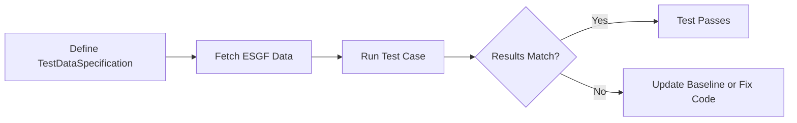
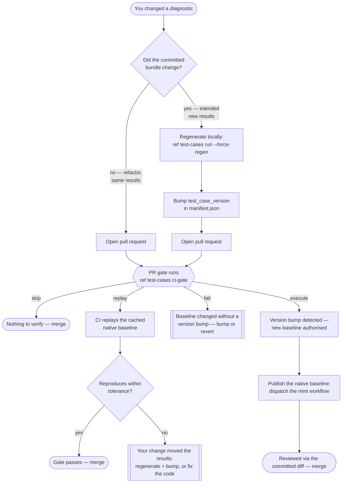

# Testing Diagnostics

This guide explains how to set up reproducible tests for your diagnostic provider package.
The testing infrastructure allows you to define `test cases`.

Each `test case` describes an execution of a diagnostic with specific datasets.
The test infrastructure takes care of fetching data from ESGF, running the diagnostic execution and,
tracking the outputs as regression tests.

## Overview

### Aim

The REF supports many diagnostics across multiple provider packages,
each with different data requirements.
Rather than maintaining a single monolithic test dataset that contains everything every diagnostic might need,
the testing infrastructure allows:

- **Diagnostic-controlled test data**:
    Each diagnostic declares exactly which datasets it needs for testing via `test_data_spec`.
    This keeps test data minimal and focused.

- **Selective fetching**: Developers only need to download test data for the diagnostics they're working on, not the entire test suite.
    This saves disk space and download time.

- **Independent testing**: Updates to a diagnostic's data requirements don't impact other diagnostics results.
    This makes it easier to contribute new diagnostics.

- **Reproducible results**: By pinning specific ESGF datasets (source, experiment, time range),
  tests produce consistent results across different machines and CI environments.

/// note
The [ref-sample-data](https://github.com/Climate-REF/ref-sample-data) repository
represents the original monolithic approach - a centrally managed collection of decimated test datasets for all diagnostics.
While this worked for the first round of diagnostics,
it requires coordination to add new test data and updating the sample data often lead to impacts for other diagnostics.

An alternative approach was required that was easier to maintain ([#472](https://github.com/Climate-REF/climate-ref/issues/472)).
///

### Workflow

The testing workflow consists of:

1. **Define test data specifications** in your diagnostic class
2. **Fetch test data** from ESGF using CLI commands
3. **Run test cases** via CLI or pytest
4. **Compare results** against regression baselines


```mermaid
flowchart LR
    A[Define TestDataSpecification] --> B[Fetch ESGF Data]
    B --> C[Run Test Case]
    C --> D{Results Match?}
    D -->|Yes| E[Test Passes]
    D -->|No| F[Update Baseline or Fix Code]
```

## Defining Test Data Specifications

Each diagnostic defines a `test_data_spec` attribute that declares exactly which datasets it needs for testing.
The specification contains one or more independent test cases.
Each test case represents the data needed for a single execution.

When a test case runs, only those specific datasets are used -
the test infrastructure filters out any other data that may be present.
This ensures reproducible test execution regardless of what other data exists locally.

### Basic Structure

```python
from climate_ref_core.testing import TestDataSpecification, TestCase
from climate_ref_core.esgf import CMIP6Request, Obs4MIPsRequest

class MyDiagnostic(Diagnostic):
    name = "My Diagnostic"
    slug = "my-diagnostic"

    # ... data_requirements and other attributes ...

    test_data_spec = TestDataSpecification(
        test_cases=(
            TestCase(
                name="default",
                description="Standard test with historical data",
                requests=(
                    CMIP6Request(
                        slug="test-tas",
                        facets={
                            "source_id": "ACCESS-ESM1-5",
                            "experiment_id": "historical",
                            "variable_id": "tas",
                            "member_id": "r1i1p1f1",
                            "table_id": "Amon",
                        },
                    ),
                ),
            ),
        ),
    )
```

### TestCase Attributes

| Attribute       | Type                         | Description                                                    |
| --------------- | ---------------------------- | -------------------------------------------------------------- |
| `name`          | `str`                        | Unique identifier (e.g., `"default"`, `"edge-case"`)           |
| `description`   | `str`                        | Human-readable description of the test scenario                |
| `requests`      | `tuple[ESGFRequest, ...]`    | ESGF requests to fetch the required datasets for the test case |
| `datasets`      | `ExecutionDatasetCollection` | Explicit datasets (highest priority)                           |
| `datasets_file` | `str`                        | Path to YAML file with datasets (relative to package)          |

### ESGF Requests

Each test case declares the set of data that is required from ESGF.
Only datasets resolved by these requests will be available when using the test case.

ESGF's [Metagrid](https://esgf-node.ornl.gov/) can be used to explore the results from applying different facet filters.

#### CMIP6Request

For CMIP6 model output:

```python
from climate_ref_core.esgf import CMIP6Request

CMIP6Request(
    slug="unique-identifier",
    facets={
        "source_id": "ACCESS-ESM1-5",      # Model name
        "experiment_id": "historical",      # Experiment
        "variable_id": "tas",               # Variable
        "member_id": "r1i1p1f1",           # Ensemble member
        "table_id": "Amon",                # MIP table (frequency)
        "grid_label": "gn",                # Optional: grid type
    },
    time_span=("2000-01", "2014-12"),  # Optional: YYYY-MM format
    remove_ensembles=False,             # Keep all ensemble members
)
```

#### Obs4MIPsRequest

For observational datasets:

```python
from climate_ref_core.esgf import Obs4MIPsRequest

Obs4MIPsRequest(
    slug="obs-tas",
    facets={
        "source_id": "ERA5",
        "variable_id": "tas",
        "frequency": "mon",
    },
)
```

### Common CMIP6 Facets

| Facet            | Description     | Example                    |
| ---------------- | --------------- | -------------------------- |
| `source_id`      | Model name      | `"ACCESS-ESM1-5"`          |
| `experiment_id`  | Experiment      | `"historical"`, `"ssp585"` |
| `variable_id`    | Variable        | `"tas"`, `"pr"`            |
| `member_id`      | Ensemble member | `"r1i1p1f1"`               |
| `table_id`       | MIP table       | `"Amon"`, `"fx"`  |
| `grid_label`     | Grid type       | `"gn"`, `"gr"`             |
| `institution_id` | Institution     | `"CSIRO"`                  |
| `activity_drs`   | Activity        | `"CMIP"`, `"ScenarioMIP"`  |

### Dataset Resolution Priority

When running a test case, datasets are resolved in this order:

1. **Explicit `datasets`**: If provided, used directly
2. **`datasets_file`**: Load from YAML file
3. **Solve from catalog**: Use `requests` to filter available data from the requests and solved

### Using a Datasets File

For complex test cases or when you need precise control over dataset paths,
you can specify datasets via a YAML file:

```python
TestCase(
    name="from-file",
    description="Test case loading datasets from YAML",
    datasets_file="test_datasets/my_diagnostic.yaml",
)
```

The YAML file follows the same structure used by the data catalog:

```yaml
# test_datasets/my_diagnostic.yaml
cmip6:
  slug_column: instance_id
  selector:
    source_id: ACCESS-ESM1-5
    member_id: r1i1p1f1
  datasets:
    - instance_id: CMIP6.CMIP.CSIRO.ACCESS-ESM1-5.historical.r1i1p1f1.Amon.tas.gn.v20191115
      path: /path/to/tas_Amon_ACCESS-ESM1-5_historical_r1i1p1f1_gn_200001-201412.nc
      variable_id: tas
      table_id: Amon
      source_id: ACCESS-ESM1-5
      experiment_id: historical
      member_id: r1i1p1f1
      grid_label: gn
      version: v20191115
    - instance_id: CMIP6.CMIP.CSIRO.ACCESS-ESM1-5.historical.r1i1p1f1.fx.areacella.gn.v20191115
      path: /path/to/areacella_fx_ACCESS-ESM1-5_historical_r1i1p1f1_gn.nc
      variable_id: areacella
      table_id: fx
      source_id: ACCESS-ESM1-5
      experiment_id: historical
      member_id: r1i1p1f1
      grid_label: gn
      version: v20191115
```

This approach is useful when:

- You have pre-existing test data in specific locations
- You need to test against local modifications of datasets
- You want to test a specific edgecase

## CLI Commands

### Listing Test Cases

View all available test cases:

```bash
ref test-cases list
ref test-cases list --provider ilamb
```

### Fetching Test Data

Download ESGF data for your test cases:

```bash
# Fetch all test data
ref test-cases fetch

# Fetch for a specific provider
ref test-cases fetch --provider my-provider

# Fetch for a specific diagnostic
ref test-cases fetch --provider my-provider --diagnostic my-diagnostic

# Dry run (show what would be fetched)
ref test-cases fetch --dry-run

# Fetch and run a test case in one step
ref test-cases run --provider my-provider --diagnostic my-diagnostic --fetch
```

When data is fetched, it is stored in intake-esgf's cache directory and a catalog YAML file
is saved to track the resolved datasets.
Test data is stored within each provider package using a diagnostic-first structure:

```raw
packages/climate-ref-{provider}/tests/test-data/
└── {diagnostic}/
    └── {test_case}/
        ├── catalog.yaml           # Dataset metadata (tracked in git)
        ├── catalog.paths.yaml     # Local file paths (gitignored)
        ├── manifest.json          # Baseline metadata (written by `run`/`mint`)
        └── regression/            # Committed baseline bundle (tracked in git)
            ├── series.json
            ├── diagnostic.json
            └── output.json
```

The catalog is split into two files:

- **`catalog.yaml`**: Contains dataset metadata (instance IDs, facets, selectors).
This file is version-controlled and portable across machines.
- **`catalog.paths.yaml`**: Contains the local file paths for each dataset.
This file is gitignored since paths are machine-specific.

This separation allows the catalog metadata to be shared via git while each developer's local paths remain independent.

#### Data Caching

The `ref test-cases fetch` command uses [intake-esgf](https://github.com/esgf2-us/intake-esgf)
to download datasets from ESGF if they cannot be found locally.
`intake-esgf` supports a two-tier cache system configured via `~/.config/intake-esgf/conf.yaml`:

- **`esg_dataroot`**: Paths checked FIRST for existing data (read-only). Ideal for institutional ESGF mirrors or shared drives.
- **`local_cache`**: Where new downloads are stored if not found in `esg_dataroot`.

The fetch command saves a catalog YAML file that records the paths to these files,
so subsequent test runs can locate the data without re-scanning directories.

/// Note | Using shared ESGF data (HPC/shared drives)

On HPC systems, point `esg_dataroot` at an existing shared CMIP6 archive so intake-esgf
reuses it instead of re-downloading; new files still go to `local_cache`:

```yaml
# ~/.config/intake-esgf/conf.yaml
esg_dataroot:
  - /shared/cmip6/data      # Read-only institutional mirror, checked first
local_cache:
  - /scratch/$USER/.esgf    # New downloads land here
```

See the [intake-esgf documentation](https://github.com/esgf2-us/intake-esgf) for more options.
///

### Running Test Cases

Execute a test case:

```bash
# Run the default test case
ref test-cases run --provider my-provider --diagnostic my-diagnostic

# Run a specific test case
ref test-cases run --provider my-provider --diagnostic my-diagnostic --test-case edge-case

# Specify output directory
ref test-cases run --provider my-provider --diagnostic my-diagnostic --output-directory ./output

# Regenerate regression baseline
ref test-cases run --provider my-provider --diagnostic my-diagnostic --force-regen
```

## Writing Pytest Tests

The CLI provides a standard harness for running simple test cases.
Sometimes additional custom tests maybe required which require writing tests via `pytest`.

### Using the `run_test_case` Fixture

The `run_test_case` fixture automatically handles missing data by skipping tests:

```python
import pytest

def test_my_diagnostic(run_test_case):
    from my_provider import MyDiagnostic

    diagnostic = MyDiagnostic()
    result = run_test_case.run(diagnostic, "default")

    assert result.successful
    assert result.metric_bundle_filename is not None
```

In future, tests will be generated for each of the test cases.

### Marking Tests

Use pytest markers for test categorization:

```python
@pytest.mark.slow
def test_full_resolution(run_test_case):
    """Test with full-resolution ESGF data (slow)."""
    ...

@pytest.mark.requires_esgf_data
def test_requires_fetched_data(run_test_case):
    """Test that requires fetched ESGF data."""
    ...
```

Run specific test categories:

```bash
# Include slow tests
pytest --slow

# Skip tests requiring ESGF data
pytest -m "not requires_esgf_data"
```

## Regression baselines

Diagnostics can be slow, so the REF doesn't re-run them on every pull request.
Instead each test case is pinned to a **regression baseline** — a recorded, known-good
output — and CI checks changes against it.

A baseline has two layers (see
[Regression baselines](../background/regression-baselines.md) for the full model):

- the small, git-tracked **committed bundle** (`series.json`, `diagnostic.json`,
  `output.json`) under `regression/`, which is what review and CI gate on; and
- the heavy **native bundle** (`.nc`, `.png`, ...), stored by digest in a shared object
  store and fetched anonymously.

`manifest.json` (shown in the layout above) binds the two, recording a `test_case_version`
that authorises a new baseline, the digests of both layers, and the input catalog's hash.

### Creating or updating a baseline

Regenerate the committed bundle when you add a diagnostic or intend to change its results:

```bash
ref test-cases run --provider my-provider --diagnostic my-diagnostic --force-regen
```

We keep committed files small — a pre-commit hook flags anything over a few MB.
Large outputs belong in the native bundle, published with `mint` (see below).

### Comparing against the baseline

The `execution_regression` fixture compares results automatically:

```python
def test_regression(run_test_case, execution_regression):
    from my_provider import MyDiagnostic

    diagnostic = MyDiagnostic()
    result = run_test_case.run(diagnostic, "default")

    # Compare metric bundle against baseline
    execution_regression.check(result, "my-provider/my-diagnostic/default")
```

### The pull request workflow

When you open a pull request, CI decides *how* to verify each test case from what your
branch changed — you don't re-run every diagnostic. The diagram shows the path; the table
below says what each outcome asks of you.


```mermaid
flowchart TD
    start([You changed a diagnostic]) --> q1{Did the committed<br/>bundle change?}
    q1 -->|"no — refactor,<br/>same results"| openA[Open pull request]
    q1 -->|"yes — intended<br/>new results"| regen["Regenerate locally:<br/>ref test-cases run --force-regen"]
    regen --> bump["Bump test_case_version<br/>in manifest.json"]
    bump --> openB[Open pull request]

    openA --> gate{{"PR gate runs<br/>ref test-cases ci-gate"}}
    openB --> gate

    gate -->|skip| done1([Nothing to verify — merge])
    gate -->|replay| rep[CI replays the cached<br/>native baseline]
    rep --> repok{Reproduces within<br/>tolerance?}
    repok -->|yes| done2([Gate passes — merge])
    repok -->|no| fixcode[["Your change moved the results:<br/>regenerate + bump, or fix the code"]]
    gate -->|fail| failed[["Baseline changed without a<br/>version bump — bump or revert"]]
    gate -->|execute| flagged[Version bump detected —<br/>new baseline authorised]
    flagged --> mint["Publish the native baseline:<br/>dispatch the mint workflow"]
    mint --> done3([Reviewed via the committed diff — merge])
```

| Outcome | Meaning | What to do |
| --- | --- | --- |
| **skip** | Nothing relevant changed. | Nothing. |
| **replay** | Your change could affect the result; CI re-checks the cached native baseline against the committed bundle. | Nothing if it passes. On drift, regenerate and bump `test_case_version`, or fix the code. |
| **execute** | You bumped `test_case_version`, authorising a new baseline; the credential-free PR tier flags it rather than publishing native files. | Publish the native baseline (below); the new committed bundle is reviewed in the diff. |
| **fail** | The committed bundle or input catalog changed without a `test_case_version` bump (or the version moved backwards). | Bump `test_case_version` to authorise it, or revert the edit. |

Bump `test_case_version` whenever you *intend* to change a baseline — it tells reviewers and CI the new output is correct.

!!! tip "Check the gate locally before pushing"
    Run the same gate your pull request will hit with `make regression-gate` (it compares against `origin/main`).

#### Publishing a native baseline

Native files are written to the object store only by `ref test-case mint`, which needs write credentials.
Instead of every contributor requiring credentials, we run the minting via a CI workflow:

1. Regenerate and commit the new bundle locally (`run --force-regen`) and bump `test_case_version`.
2. Run the **"Regression baselines (mint)"** workflow from the Actions tab,
   dispatched **on your branch** (gated behind a reviewed environment).
   It uploads the native files and commits the updated `manifest.json` back to your branch.
3. The PR gate then replays the published baseline.

Use the **`--dry-run`** input to preflight without uploading.
If you hold credentials locally, `ref test-cases mint` does the same from your machine.

## Troubleshooting

### Common Errors

| Error                    | Cause                              | Solution                          |
| ------------------------ | ---------------------------------- | --------------------------------- |
| `NoTestDataSpecError`    | Diagnostic has no `test_data_spec` | Add `test_data_spec` attribute    |
| `TestCaseNotFoundError`  | Invalid test case name             | Check `test_data_spec.case_names` |
| `DatasetResolutionError` | Missing test data                  | Run `ref test-cases fetch`        |
| `No datasets found`      | ESGF query returned empty          | Check facets are correct          |

### Debugging Tips

1. **List available test cases**:

   ```bash
   ref test-cases list --provider my-provider
   ```

2. **Check fetched data catalogs**:

   ```bash
   # List test case directories for a provider
   ls packages/climate-ref-my-provider/tests/test-data/

   # View catalog metadata for a test case
   cat packages/climate-ref-my-provider/tests/test-data/my-diagnostic/default/catalog.yaml

   # View local paths (if exists)
   cat packages/climate-ref-my-provider/tests/test-data/my-diagnostic/default/catalog.paths.yaml
   ```

3. **Run with verbose logging**:

   ```bash
   ref --verbose test-cases run --provider my-provider --diagnostic my-diagnostic
   ```

4. **Debug path resolution**:

   If catalogs aren't being written, enable debug logging to see how paths are resolved:

   ```bash
   LOGURU_LEVEL=DEBUG ref test-cases fetch --provider my-provider --diagnostic my-diagnostic
   ```

   The logs will show:
   - Which provider module is being looked up
   - Whether the `tests/` directory exists (required for dev checkout detection)
   - The derived test data directory path
   - Whether catalogs/regression directories are being created

## Other useful links

- [Adding Custom Diagnostics](adding_custom_diagnostics.md)
- [Running Diagnostics Locally](running-diagnostics-locally.py)
- [Dataset Selection](dataset-selection.py)
