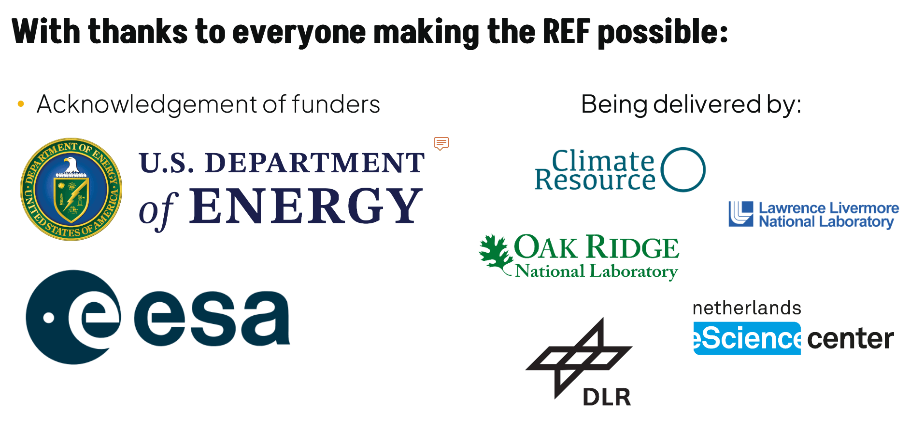

# Rapid Evaluation Framework (REF)

**Status**: This project is in active development. We expect to be ready for beta releases in Q2 2025.

The Rapid Evaluation Framework(REF) is a set of Python packages that provide the ability to manage the execution of calculations against climate datasets.
The aim is to be able to evaluate climate data against a set of reference data in near-real time as datasets are published,
and to update any produced data and figures as new datasets become available.
This is somewhat analogous to a CI/CD pipeline for climate data.

The REF is designed to be run in a variety of environments, including local execution, cloud-based execution, and execution on HPC systems.
The REF can be run as a standalone application, as a set of services, or as a set of docker containers.

REF is a [community project](https://wcrp-cmip.org/cmip-phases/cmip7/rapid-evaluation-framework/), and we welcome contributions from anyone.

---

[](https://github.com/Climate-REF/climate-ref/actions/workflows/ci.yaml)
[](https://codecov.io/gh/Climate-REF/climate-ref)
[](https://climate-ref.readthedocs.io)

**PyPI :**
[](https://pypi.org/project/climate-ref/)
[](https://pypi.org/project/climate-ref/)

**Other info :**
[](https://github.com/Climate-REF/climate-ref/blob/main/LICENCE)
[](https://scientific-python.org/specs/spec-0000/)
[](https://github.com/Climate-REF/climate-ref/commits/main)
[](https://github.com/Climate-REF/climate-ref/graphs/contributors)

---

After [installation](installation.md), you can start using the REF via the CLI tool:

```bash
$ ref

 Usage: ref [OPTIONS] COMMAND [ARGS]...

 A CLI for the Assessment Fast Track Rapid Evaluation Framework

 This CLI provides a number of commands for managing and executing diagnostics.

╭─ Options ────────────────────────────────────────────────────────────────────────────────────────────────────────────╮
│ --configuration-directory          PATH                        Configuration directory [default: None]               │
│ --verbose                  -v                                  Set the log level to DEBUG                            │
│ --quiet                    -q                                  Set the log level to WARNING                          │
│ --log-level                        [ERROR|WARNING|DEBUG|INFO]  Set the level of logging information to display       │
│                                                                [default: INFO]                                       │
│ --version                                                      Print the version and exit                            │
│ --install-completion                                           Install completion for the current shell.             │
│ --show-completion                                              Show completion for the current shell, to copy it or  │
│                                                                customize the installation.                           │
│ --help                                                         Show this message and exit.                           │
╰──────────────────────────────────────────────────────────────────────────────────────────────────────────────────────╯
╭─ Commands ───────────────────────────────────────────────────────────────────────────────────────────────────────────╮
│ solve        Solve for executions that require recalculation                                                         │
│ config       View and update the REF configuration                                                                   │
│ datasets     View and ingest input datasets                                                                          │
│ executions   View diagnostic executions                                                                              │
│ providers    Manage the REF providers.                                                                               │
│ celery       Managing remote execution workers                                                                       │
╰──────────────────────────────────────────────────────────────────────────────────────────────────────────────────────╯
```

This provides the ability to:

* **Ingest** new input datasets
* **Solve** for the unique metrics executions that are required
* **Execute** the metrics either locally or remotely

This CLI tool is the main interface to the REF and is used to manage the REF.


## Where to next?

We recommend starting with the [Getting Started](getting-started/01-configure.md) guide,
which will walk you through the initial steps of configuring and using the REF.

Some other potential points of interest:

- [Installation][installation]
- [Basic Concepts][basic-concepts]
- [Architecture overview][architecture]
- [How to Guides][how-to-guides]

---


